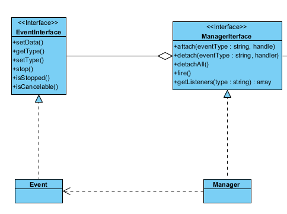

### 使用事件管理
下面是一个简单的事件管理的使用例子
```php
<?php

use Phalcon\Di;
use Phalcon\Events\Manager;
use Phalcon\Mvc\Dispatcher;
use Phalcon\Events\Event;

$di = new Di();

$modules = [
  'backend' => [
      'className' => 'App\Backend\Bootstrap',
      'path'      => '/app/Modules/Backend/Bootstrap.php',
      'metadata'  => [
          'controllersNamespace' => 'App\Backend\Controllers',
      ],
  ],
];

$manager = new Manager();

// 挂载到事件管理器上(Manager 主题)
// 在每个需要触发事件的地方调用管理器的fire接口: eventsManager->fire("dispatch:beforeForward", this, forward);
// fire调用管理器内部fireQueue()接口，因为可能一个事件需要触发多个观察者
// call_user_func_array 开始执行注入的观察者(就是下面的回调函数)
// Event可能是主题与观察者之间的桥梁
$manager->attach(
  'dispatch:beforeForward',
  // 下面才是观察者
  function (Event $event, Dispatcher $dispatcher, array $forward) use ($modules) {
      $metadata = $modules[$forward['module']]['metadata'];
      $dispatcher->setModuleName($forward['module']);
      $dispatcher->setNamespaceName($metadata['controllersNamespace']);
  }
);

$dispatcher = new Dispatcher();
$dispatcher->setDI($di);
$dispatcher->setEventsManager($manager);
$di->set('dispatcher', $dispatcher);
$dispatcher->forward(
  [
      'module'     => 'backend',
      'controller' => 'posts',
      'action'     => 'index',
  ]
);

echo $dispatcher->getModuleName(); // will display properly 'backend'
```
### 剖析事件机制
```php
// 事件接口
namespace Phalcon\Events;

/**
 * Phalcon\Events\EventInterface
 *
 * Interface for Phalcon\Events\Event class
 */
interface EventInterface
{
	/**
	 * Gets event data
	 * 获取事件数据
	 */
	public function getData() -> var;

	/**
	 * Sets event data
	 * 设置事件数据
	 * @param mixed data
	 */
	public function setData(data = null) -> <EventInterface>;

	/**
	 * Gets event type
	 * 获取事件类型
	 */
	public function getType() -> var;

	/**
	 * Sets event type
	 * 设置事件类型
	 */
	public function setType(string! type) -> <EventInterface>;

	/**
	 * Stops the event preventing propagation
	 * 暂停事件传播
	 */
	public function stop() -> <EventInterface>;

	/**
	 * Check whether the event is currently stopped
	 * 事件是否已经暂停传播了
	 */
	public function isStopped() -> boolean;

	/**
	 * Check whether the event is cancelable
	 * 事件是否可取消
	 */
	public function isCancelable() -> boolean;
}
```



```php
<?php
// 事件管理接口
namespace Phalcon\Events;

/**
 * Phalcon\Events\Manager
 *
 * Phalcon Events Manager, offers an easy way to intercept and manipulate, if needed,
 * the normal flow of operation. With the EventsManager the developer can create hooks or
 * plugins that will offer monitoring of data, manipulation, conditional execution and much more.
 */
interface ManagerInterface
{

	/**
	 * Attach a listener to the events manager
	 *
	 * @param string eventType
	 * @param object|callable handler
	 */
	public function attach(string! eventType, handler);

	/**
	 * Detach the listener from the events manager
	 *
	 * @param string eventType
	 * @param object handler
	 */
	public function detach(string! eventType, handler);

	/**
	 * Removes all events from the EventsManager
	 */
	public function detachAll(string! type = null);

	/**
	 * Fires an event in the events manager causing the active listeners to be notified about it
	 * 触发事件发送(notify())
	 *
	 * @param string eventType
	 * @param object source
	 * @param mixed  data
	 * @return mixed
	 */
	public function fire(string! eventType, source, data = null);

	/**
	 * Returns all the attached listeners of a certain type
	 *
	 * @param string type
	 * @return array
	 */
	public function getListeners(string! type);
}

```


if eventsManager->fire("db:beforeQuery", this)
