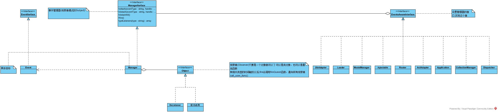

所有实现EventsAwareInterface接口的类，都可以设置/获取事件管理器，`实现类`可以触发事件发生，如Loader类
```php
<?php
class Loader implements EventsAwareInterface
{
    /**
     * Sets the events manager
     */
    public function setEventsManager(<ManagerInterface> eventsManager)
    {
      let this->_eventsManager = eventsManager;
    }

    /**
     * Returns the internal event manager
     */
    public function getEventsManager() -> <ManagerInterface>
    {
      return this->_eventsManager;
    }

    /**
     * Checks if a file exists and then adds the file by doing virtual require
     */
    public function loadFiles()
    {
      var filePath;
      // 循环加载文件
      for filePath in this->_files {
        if typeof this->_eventsManager == "object" {
          let this->_checkedPath = filePath;
            // 触发事件接口
            this->_eventsManager->fire("loader:beforeCheckPath", this, filePath);
        }
      }

    }

}
```

Manager(具体目标)实现了ManagerIterface(是Subject)接口,就可以添加、删除、触发观察者.
```

```
