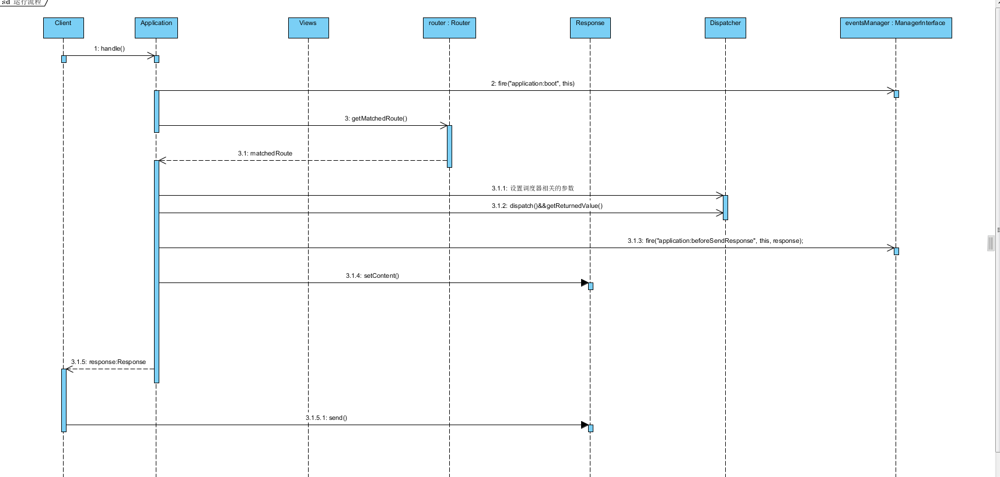

下面是一个简单的Phalcon启动文件(index.php)，你可以从[这里](https://docs.phalconphp.com/zh/3.2/tutorial-base)找到详细的文档.

```php
<?php
use Phalcon\Loader;
use Phalcon\Mvc\View;
use Phalcon\Mvc\Application;
use Phalcon\Di\FactoryDefault;
use Phalcon\Mvc\Url as UrlProvider;

// Define some absolute path constants to aid in locating resources
define('BASE_PATH', dirname(__DIR__));
define('APP_PATH', BASE_PATH . '/app');

// Register an autoloader
$loader = new Loader();

$loader->registerDirs(
    [
        APP_PATH . '/controllers/',
        APP_PATH . '/models/',
    ]
);

$loader->register();

// Create a DI
$di = new FactoryDefault();

// Setup the view component
$di->set(
    'view',
    function () {
        $view = new View();
        $view->setViewsDir(APP_PATH . '/views/');
        return $view;
    }
);

// Setup a base URI so that all generated URIs include the "tutorial" folder
$di->set(
    'url',
    function () {
        $url = new UrlProvider();
        $url->setBaseUri('/');
        return $url;
    }
);

$application = new Application($di);

try {
    // Handle the request
    $response = $application->handle();

    $response->send();
} catch (\Exception $e) {
    echo 'Exception: ', $e->getMessage();
}
```

通过`$di = new FactoryDefault()`生成一个Di对象，然后`$application = new Application($di)`传入到Application对象内. 应用对象内部就可以通过Di获取各种需要的服务对象.（默认注入了一些常用的对象）

```php
class FactoryDefault extends \Phalcon\Di
{

	/**
	 * Phalcon\Di\FactoryDefault constructor
	 */
	public function __construct()
	{
		parent::__construct();

		let this->_services = [
			"router":             new Service("router", "Phalcon\\Mvc\\Router", true),
			"dispatcher":         new Service("dispatcher", "Phalcon\\Mvc\\Dispatcher", true),
			"url":                new Service("url", "Phalcon\\Mvc\\Url", true),
			"modelsManager":      new Service("modelsManager", "Phalcon\\Mvc\\Model\\Manager", true),
			"modelsMetadata":     new Service("modelsMetadata", "Phalcon\\Mvc\\Model\\MetaData\\Memory", true),
			"response":           new Service("response", "Phalcon\\Http\\Response", true),
			"cookies":            new Service("cookies", "Phalcon\\Http\\Response\\Cookies", true),
			"request":            new Service("request", "Phalcon\\Http\\Request", true),
			"filter":             new Service("filter", "Phalcon\\Filter", true),
			"escaper":            new Service("escaper", "Phalcon\\Escaper", true),
			"security":           new Service("security", "Phalcon\\Security", true),
			"crypt":              new Service("crypt", "Phalcon\\Crypt", true),
			"annotations":        new Service("annotations", "Phalcon\\Annotations\\Adapter\\Memory", true),
			"flash":              new Service("flash", "Phalcon\\Flash\\Direct", true),
			"flashSession":       new Service("flashSession", "Phalcon\\Flash\\Session", true),
			"tag":                new Service("tag", "Phalcon\\Tag", true),
			"session":            new Service("session", "Phalcon\\Session\\Adapter\\Files", true),
			"sessionBag":         new Service("sessionBag", "Phalcon\\Session\\Bag"),
			"eventsManager":      new Service("eventsManager", "Phalcon\\Events\\Manager", true),
			"transactionManager": new Service("transactionManager", "Phalcon\\Mvc\\Model\\Transaction\\Manager", true),
			"assets":             new Service("assets", "Phalcon\\Assets\\Manager", true)
		];
	}
}
```
应用对象通过`$response = $application->handle()`处理http请求，并获取Response对象。最后`$response->send()`将结果发送给浏览器。接下来，我们看下Application的执行流程：




```php
// 代码注释分析

/**
 * Handles a MVC request
 */
public function handle(string uri = null) -> <ResponseInterface> | boolean
{
  var dependencyInjector, eventsManager, router, dispatcher, response, view,
    module, moduleObject, moduleName, className, path,
    implicitView, returnedResponse, controller, possibleResponse,
    renderStatus, matchedRoute, match;

  let dependencyInjector = this->_dependencyInjector;
  if typeof dependencyInjector != "object" {
    throw new Exception("A dependency injection object is required to access internal services");
  }

  // 获取事件对象
  let eventsManager = <ManagerInterface> this->_eventsManager;

  /**
   * Call boot event, this allow the developer to perform initialization actions
   */
  // 设置了事件对象，就开始调用application:boot事件
  if typeof eventsManager == "object" {
    if eventsManager->fire("application:boot", this) === false {
      return false;
    }
  }

  // 获取router并解析路由
  let router = <RouterInterface> dependencyInjector->getShared("router");
  /**
   * Handle the URI pattern (if any)
   */
  router->handle(uri);

  /**
   * If a 'match' callback was defined in the matched route
   * The whole dispatcher+view behavior can be overridden by the developer
   */
  // 获取匹配的路由对象
  let matchedRoute = router->getMatchedRoute();
  if typeof matchedRoute == "object" {
    let match = matchedRoute->getMatch();
    if match !== null {

      if match instanceof \Closure {
        let match = \Closure::bind(match, dependencyInjector);
      }

      /**
       * Directly call the match callback
       * 直接调用函数，并获取返回值
       */
      let possibleResponse = call_user_func_array(match, router->getParams());

      /**
       * If the returned value is a string return it as body
       */
      if typeof possibleResponse == "string" {
        let response = <ResponseInterface> dependencyInjector->getShared("response");
        response->setContent(possibleResponse);
        return response;
      }

      /**
       * If the returned string is a ResponseInterface use it as response
       */
      if typeof possibleResponse == "object" {
        if possibleResponse instanceof ResponseInterface {
          possibleResponse->sendHeaders();
          possibleResponse->sendCookies();
          return possibleResponse;
        }
      }
    }
  }

  /**
   * If the router doesn't return a valid module we use the default module
   */
  let moduleName = router->getModuleName();
  if !moduleName {
    let moduleName = this->_defaultModule;
  }

  let moduleObject = null;

  /**
   * 解析模块(自动加载的自定义)
   * Process the module definition
   */
  if moduleName {

    if typeof eventsManager == "object" {
      if eventsManager->fire("application:beforeStartModule", this, moduleName) === false {
        return false;
      }
    }

    /**
     * Gets the module definition
     */
    let module = this->getModule(moduleName);

    /**
     * A module definition must ne an array or an object
     */
    if typeof module != "array" && typeof module != "object" {
      throw new Exception("Invalid module definition");
    }

    /**
     * An array module definition contains a path to a module definition class
     */
    if typeof module == "array" {

      /**
       * Class name used to load the module definition
       */
      if !fetch className, module["className"] {
        let className = "Module";
      }

      /**
       * If developer specify a path try to include the file
       */
      if fetch path, module["path"] {
        if !class_exists(className, false) {
          if !file_exists(path) {
            throw new Exception("Module definition path '" . path . "' doesn't exist");
          }

          require path;
        }
      }

      let moduleObject = <ModuleDefinitionInterface> dependencyInjector->get(className);

      /**
       *  自动加载
       * 'registerAutoloaders' and 'registerServices' are automatically called
       */
      moduleObject->registerAutoloaders(dependencyInjector);
      moduleObject->registerServices(dependencyInjector);

    } else {

      /**
       * A module definition object, can be a Closure instance
       */
      if !(module instanceof \Closure) {
        throw new Exception("Invalid module definition");
      }

      let moduleObject = call_user_func_array(module, [dependencyInjector]);
    }

    /**
     * Calling afterStartModule event
     */
    if typeof eventsManager == "object" {
      eventsManager->fire("application:afterStartModule", this, moduleObject);
    }
  }

  /**
   * Check whether use implicit views or not
   */
  let implicitView = this->_implicitView;

  if implicitView === true {
    let view = <ViewInterface> dependencyInjector->getShared("view");
  }

  /**
   * 调度器处理Controller相关的对象
   * We get the parameters from the router and assign them to the dispatcher
   * Assign the values passed from the router
   */
  let dispatcher = <DispatcherInterface> dependencyInjector->getShared("dispatcher");
  dispatcher->setModuleName(router->getModuleName());
  dispatcher->setNamespaceName(router->getNamespaceName());
  dispatcher->setControllerName(router->getControllerName());
  dispatcher->setActionName(router->getActionName());
  dispatcher->setParams(router->getParams());

  /**
   * Start the view component (start output buffering)
   */
  if implicitView === true {
    view->start();
  }

  /**
   * Calling beforeHandleRequest
   */
  if typeof eventsManager == "object" {
    if eventsManager->fire("application:beforeHandleRequest", this, dispatcher) === false {
      return false;
    }
  }

  /**
   * The dispatcher must return an object
   */
  let controller = dispatcher->dispatch();

  /**
   * Get the latest value returned by an action
   */
  let possibleResponse = dispatcher->getReturnedValue();

  /**
   * Returning false from an action cancels the view
   */
  if typeof possibleResponse == "boolean" && possibleResponse === false {
    let response = <ResponseInterface> dependencyInjector->getShared("response");
  } else {

    /**
     * Returning a string makes use it as the body of the response
     */
    if typeof possibleResponse == "string" {
      let response = <ResponseInterface> dependencyInjector->getShared("response");
      response->setContent(possibleResponse);
    } else {

      /**
       * Check if the returned object is already a response
       */
      let returnedResponse = ((typeof possibleResponse == "object") && (possibleResponse instanceof ResponseInterface));

      /**
       * Calling afterHandleRequest
       */
      if typeof eventsManager == "object" {
        eventsManager->fire("application:afterHandleRequest", this, controller);
      }

      /**
       * 渲染模板
       * If the dispatcher returns an object we try to render the view in auto-rendering mode
       */
      if returnedResponse === false && implicitView === true {
        if typeof controller == "object" {

          let renderStatus = true;

          /**
           * This allows to make a custom view render
           */
          if typeof eventsManager == "object" {
            let renderStatus = eventsManager->fire("application:viewRender", this, view);
          }

          /**
           * Check if the view process has been treated by the developer
           */
          if renderStatus !== false {

            /**
             * Automatic render based on the latest controller executed
             */
            view->render(
              dispatcher->getControllerName(),
              dispatcher->getActionName()
            );
          }
        }
      }

      /**
       * Finish the view component (stop output buffering)
       */
      if implicitView === true {
        view->finish();
      }

      if returnedResponse === true {

        /**
         * We don't need to create a response because there is one already created
         */
        let response = possibleResponse;
      } else {

        let response = <ResponseInterface> dependencyInjector->getShared("response");
        if implicitView === true {

          /**
           * The content returned by the view is passed to the response service
           */
          response->setContent(view->getContent());
        }
      }
    }
  }

  /**
   * Calling beforeSendResponse
   */
  if typeof eventsManager == "object" {
    eventsManager->fire("application:beforeSendResponse", this, response);
  }

  /**
   * Headers and Cookies are automatically sent
   */
  response->sendHeaders();
  response->sendCookies();

  /**
   * Return the response
   */
  return response;
}


```
